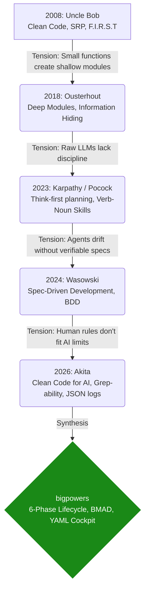

# bigpowers


> 72 agent skills synthesizing 17 years of software engineering discipline into a prescriptive methodology for solo developers.

`bigpowers` is not a random collection of best practices. It is a highly opinionated, chronological layer cake of ideas, combining classical software craftsmanship with modern AI-native architecture. 

It provides a 6-phase lifecycle with hard gates, a 94% quality threshold, and a YAML cockpit (`specs/state.yaml`) that keeps both human and AI agents perfectly aligned across complex software projects. By enforcing strict boundaries and verifiable outcomes, it allows solo developers to orchestrate multi-agent workflows with predictable, high-quality results.

## Prerequisites

- **Runtime**: Node.js v14+
- **Environment**: Bash (required for all internal scripts)
- **Tooling**: jq (highly recommended for configuration)
- **AI Tools**: Claude Code, Gemini CLI, Cursor, or pi

## Installation

```bash
# One-shot setup: downloads, syncs artifacts, and links skills
npx bigpowers

# Or install globally
npm install -g bigpowers
bigpowers
```

## Usage

```bash
# Update and re-sync your local skills
npm update -g bigpowers
bigpowers
```
For deep usage, integrate the generated skills directly into your favorite AI tool (Claude Code, Gemini CLI, Cursor). Use the provided MCP Server to expose skills dynamically:
```bash
node scripts/mcp-server.js
```

## Features

- **72 Purpose-Built Skills**: From `survey-context` to `develop-tdd`, each skill is a targeted tool for a specific phase of development.
- **Spec-Driven Cockpit**: Uses `specs/state.yaml` and `release-plan.yaml` to maintain state across agent sessions, preventing context drift.
- **Native IDE Support**: Automatically generates configurations for Cursor (`.cursor/rules`), Gemini CLI, and pi.
- **Model Context Protocol (MCP)**: Dynamic tool discovery and invocation via the included MCP server.
- **Built-in Quality Gates**: Strict verification standards (e.g., F.I.R.S.T tests, BCP accounting) enforced before any code is merged.

## The Philosophy: Concatenating References

`bigpowers` is built upon a concatenated philosophy. Each era of software engineering introduced principles that solved previous problems but created new tensions. `bigpowers` stacks these references, resolving their inherent tensions, and synthesizes them into an executable discipline for AI agents.



1. **Uncle Bob (2008)**: Established the baseline for code hygiene (Clean Code, SRP).
2. **Ousterhout (2018)**: Solved the fragmentation of Clean Code by advocating for Deep Modules.
3. **Karpathy / Pocock (2023-2024)**: Introduced strict verb-noun skill architecture for orchestrating AI.
4. **Wasowski (2024)**: Solved agent drift by introducing Spec-Driven Development (SDD) as the human-agent contract.
5. **Akita (2026)**: Adapted classical clean code for the token economy (Grep-ability, remediation hints).

## Development

```bash
git clone https://github.com/danielvm-git/bigpowers.git
cd bigpowers
npm install
# Sync artifacts from SKILL.md sources
npm run sync
```

## Tests

```bash
# Run compliance verification against Gherkin features
npm run compliance

# Validate YAML specifications and doctrine
npm run doctrine
npm run validate-specs
```

## Contributing

1. Fork the repo.
2. Create a feature branch (`git checkout -b feature/my-thing`).
3. Make your changes using the `bigpowers` methodology.
4. Commit using Conventional Commits (`git commit -am 'feat: add my thing'`).
5. Push to the branch (`git push origin feature/my-thing`).
6. Open a Pull Request.

## Changelog

See [CHANGELOG.md](CHANGELOG.md) or [Releases](https://github.com/danielvm-git/bigpowers/releases).

## Links

- **Repository**: https://github.com/danielvm-git/bigpowers
- **Issue Tracker**: https://github.com/danielvm-git/bigpowers/issues

## Acknowledgements

This project is a synthesis of decades of software engineering thought. It would not be possible without the foundational work of the authors who wrote the inspirational articles and books that shaped this methodology:

- **Robert C. Martin (Uncle Bob)** for establishing the baseline of code hygiene and the F.I.R.S.T principles in *Clean Code*.
- **John Ousterhout** for his paradigm-shifting views on Deep Modules and complexity management in *A Philosophy of Software Design*.
- **Andrej Karpathy** and **Matt Pocock** for their pioneering work on agentic skills and structuring context for LLMs.
- **Jarek Wasowski** for identifying Spec-Driven Development (SDD) as the missing link for AI agents.
- **AkitaOnRails** for adapting classical clean code principles to the reality of the AI token economy.

## License

MIT — see [LICENSE](LICENSE) for details.
