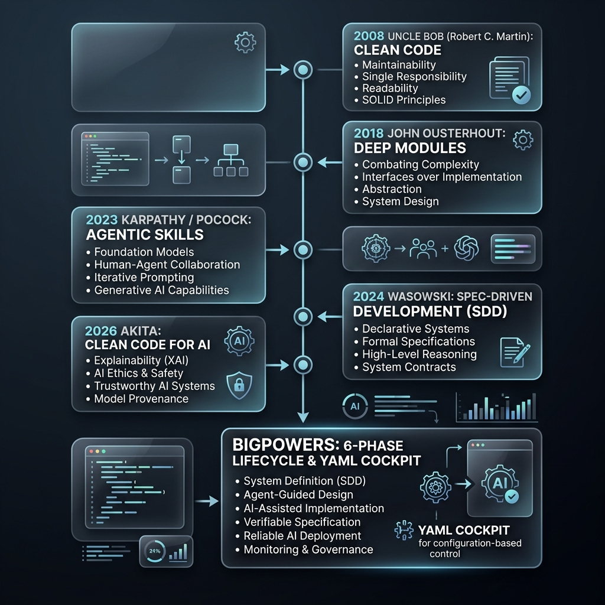

# bigpowers — Best-in-Class Agentic Skills


**Agent skills synthesizing 17 years of software engineering discipline — from Clean Code to AI-native architecture — into a single, prescriptive methodology for solo developers.**

`bigpowers` provides a prescriptive, vertical-slice methodology for building software with AI agents (Claude Code, Gemini CLI, Cursor, pi). It bridges the gap between raw LLM capabilities and professional engineering standards.

It is not a random collection of best practices. It is a chronological layer cake of ideas — each wave of thinking (Uncle Bob → Ousterhout → Karpathy → Wasowski → Akita) builds on and resolves tensions from the last, culminating in a 6-phase lifecycle with hard gates, a 94% quality threshold, and a YAML cockpit (`specs/state.yaml`) that keeps both human and agent aligned across sessions.

Published on npm: [bigpowers](https://www.npmjs.com/package/bigpowers). The skill count in the badge above is stamped automatically by `sync-skills.sh`; the canonical catalog is [`SKILL-INDEX.md`](SKILL-INDEX.md).

Docs: [bigpowers docs site](https://danielvm-git.github.io/bigpowers/) — searchable, Google-discoverable reference for all skills, guides, and ADRs.

**This methodology publishes its own evidence — see the [live receipts page](https://danielvm-git.github.io/bigpowers/receipts/).**

**See it working:** [bigpowers-showcase](https://github.com/danielvm-git/bigpowers-showcase) — a real URL shortener (CLI + SQLite) built from scratch with the full spec trail committed from day one.

---

## 🗺 How to Read This README

This README is a guided path, not a wall of reference. Start where you are:

| You want to… | Go to |
|:---|:---|
| Try it in 30 seconds | [Quick Start](#-quick-start) |
| Understand what it actually does | [Features](#-features) and [The v2.0.0 Lifecycle](#-the-v200-lifecycle) |
| Learn the ideas behind it | [Philosophical Stack](#-philosophical-stack--how-these-ideas-concatenate) |
| Look something up | [Hierarchy of Truth](#-hierarchy-of-truth) and [Project Structure](#-project-structure) |
| Wire it into pi or MCP | [pi Support](#-pi-support) and [MCP Server](#-mcp-server-model-context-protocol) |
| Contribute or hack on it | [Development](#-development) and [Contributing](#-contributing) |

After installing, ask your agent to run the `using-bigpowers` skill — it is the one-time bootstrap that explains the lifecycle and tells you which skill to call first for your situation.

---

## 🚀 Quick Start

### npm (recommended)

```bash
# Global install (no lifecycle scripts — npm v10+ safe)
npm install -g bigpowers
bigpowers setup     # runs sync + install, links skills to your tools

# Or one-shot with npx
npx bigpowers setup
```

Both commands sync skill artifacts and link them to Claude Code, Gemini CLI, and Cursor (see [Prerequisites](#-prerequisites)).

### From source (contributors)

```bash
git clone https://github.com/danielvm-git/bigpowers.git && cd bigpowers
npm install
bash scripts/install.sh
```

---

## 🛠 Prerequisites

- **Bash**: Required for all scripts.
- **Node.js**: v14+ (required for npm/npx).
- **jq**: (Highly Recommended) Used for robust configuration of tool settings.
- **AI Tools**: One or more of:
  - [Claude Code](https://claude.ai/code)
  - [Gemini CLI](https://github.com/google/gemini-cli)
  - [Cursor](https://cursor.sh/)
  - [pi](https://pi.dev/) — coding agent harness

---

## ✨ Features

- **Purpose-Built Skills**: From `survey-context` to `develop-tdd`, each skill is a targeted tool for a specific phase of development. See [`SKILL-INDEX.md`](SKILL-INDEX.md) for the full auto-generated catalog.
- **Spec-Driven Cockpit**: Uses `specs/state.yaml` and `release-plan.yaml` to maintain state across agent sessions, preventing context drift.
- **Native IDE Support**: Automatically generates configurations for Cursor (`.cursor/rules`), Gemini CLI, and pi.
- **Model Context Protocol (MCP)**: Dynamic tool discovery and invocation via the included MCP server.
- **Built-in Quality Gates**: Strict verification standards (e.g., F.I.R.S.T tests, BCP accounting) enforced before any code is merged.

---

## 🏗 The v2.0.0 Lifecycle

Every project follows the **orchestrate-project 6-phase model** (full SOP: [`docs/WORKFLOW-SOP-v2.md`](docs/WORKFLOW-SOP-v2.md)):

```
ONE TIME    seed-conventions  (CLAUDE.md, .claude/, .gemini/, agents/, skill sync)
              ↓
ONCE/PROJECT orchestrate-project
              │
              ├─ Ph1 DISCOVER   survey-context, research-first, elaborate-spec
              ├─ Ph2 ELABORATE  model-domain, grill-me, define-language, deepen-architecture
              ├─ Ph3 PLAN       scope-work, slice-tasks, plan-work → release-plan.yaml (BCP baseline)
              ├─ Ph4 BUILD      build-epic × N stories
              │
              │  Per story — 8-step build-epic cycle:
              │   1. survey-context   ← stamps story_start in state.yaml
              │   2. plan-work        ← [BCP N] tasks + verify: commands
              │   3. kickoff-branch   ← worktree + feature branch
              │   4. develop-tdd      ← RED → GREEN → REFACTOR
              │   5. verify-work      ← UAT gate
              │   6. audit-code       ← quality gate ≥ 94%
              │   7. commit-message   ← Conventional Commits + semver
              │   8. release-branch   ← land to main; writes story_end + cycle-times.yaml
              │
              ├─ Ph5 VERIFY     run-evals, verify-work (project-level)
              └─ Ph6 RELEASE    semantic-release → v1.0.0 MVP tag
```

**Semver:** projects start at `0.0.0-β`; each `feat:` story → minor bump; developer declares MVP → `1.0.0`.

**BCP accounting:** every task labeled `[BCP N]`; story total in `state.yaml`; BCP/hr logged to `specs/metrics/cycle-times.yaml`.

**next_skill signaling:** each critical-path skill writes `handoff.next_skill` to `state.yaml`. Call `survey-context` after any interruption to resume exactly where you left off.

---

## 🧠 Philosophical Stack — How These Ideas Concatenate

`bigpowers` is not a flat list of influences. It is a **chronological layer cake** — each wave of thinking builds on and resolves tensions from the previous one. No layer replaces the last; each addresses a problem the prior one created.



| Era | Source | Contribution | Tension Resolved |
|:---|:---|:---|:---|
| **2008** | [Uncle Bob](https://www.amazon.com/Clean-Code-Handbook-Software-Craftsmanship/dp/0132350882) (Clean Code) | SRP, Boy Scout Rule, F.I.R.S.T. tests, intention-revealing names | — (foundation) |
| **2018** | [Ousterhout](https://www.amazon.com/Philosophy-Software-Design-John-Ousterhout/dp/1732102201) (*A Philosophy of Software Design*) | Deep modules, information hiding, define errors out of existence | Small functions alone create shallow modules with bloated interfaces |
| **2023–24** | [Karpathy](https://github.com/multica-ai/andrej-karpathy-skills), [Superpowers](https://github.com/obra/superpowers), [Pocock](https://github.com/mattpocock/skills) | Think-first planning, verb-noun skill architecture, zoom-out strategy | Raw LLMs have no discipline — they need orchestration, not raw prompting |
| **2024** | [Wasowski](https://medium.com/@wasowski.jarek/sdd-writing-specifications-for-ai-bdd-as-the-missing-link-spec-driven-development-ad1b540b7f75) (SDD), [BCP](https://github.com/flow-ciandt/bcp-agent) | Specs as the human-agent interface; business complexity as a pre-build sizing unit | Agents drift without a verifiable spec — BDD Gherkin closes the loop |
| **2026** | [Akita](https://akitaonrails.com/2026/04/20/clean-code-para-agentes-de-ia/) (*Clean Code for AI Agents*) | Grep-ability, structured JSON logging, token economy, remediation hints in errors | Uncle Bob's rules were written for humans — agents need different code hygiene |
| **Synthesis** | BMAD + GSD (self-authored) | 6-phase lifecycle, hard gates, 94% quality threshold, `specs/state.yaml` cockpit | All the above are principles; bigpowers turns them into an executable discipline |

### How to see the concatenation in action

Each philosophical pillar has a corresponding Gherkin `.feature` file in [`specs/verifications/features/`](specs/verifications/features/) that empirically proves compliance:

| Pillar | Verification |
|:---|:---|
| Classical Craftsmanship | `cleancode.feature` |
| Complexity Management | `pocock.feature` |
| Behavioral Integrity | `karpathy.feature` |
| Spec-Driven Development | Implicit in SDD workflow |
| Agentic Standard | `akita.feature` |
| Project Conventions | `conventions.feature` |
| Original Baseline | `superpowers.feature` |

Run `npm run compliance` to audit all features. Score < 94% = hard stop.

---

## 📖 Hierarchy of Truth

| Level | Document | Responsibility |
| :--- | :--- | :--- |
| **Vision** | `docs/PRINCIPLES.md` | Philosophical foundations and evolution. |
| **Context** | `specs/tech-architecture/TECH_STACK_LATEST.md` | Tech stack, architecture, and domain notes. |
| **Scope** | `specs/product/SCOPE_LATEST.yaml` | In-scope / out-of-scope and success criteria. |
| **Vision** | `specs/product/VISION_LATEST.yaml` | North star and initiative success criteria. |
| **Decisions** | `specs/adr/` | Architectural Decision Records (irreversible choices). |
| **Roadmap** | `specs/release-plan.yaml` + `specs/epics/` | WSJF-prioritized epics and stories with BCP baseline. |
| **Current** | `specs/state.yaml` | Session flow, active epic, `handoff.next_skill`, timestamps. |
| **Metrics** | `specs/metrics/cycle-times.yaml` | Per-story BCPs, cycle minutes, BCP/hr (v2.0.0). |
| **Index** | `SKILL-INDEX.md` | Canonical list of all active skills (auto-generated). |
| **Style** | `CONVENTIONS.md` | Coding, testing, and naming standards. |

---

## 📁 Project Structure

- `skills/[skill-name]/`: Source files for each of the 72 skills.
- `scripts/`: Installation, syncing, and compliance tools.
- `specs/`: YAML cockpit — `state.yaml`, `release-plan.yaml`, `epics/`, `execution-status.yaml`, `requirements/`.
- `specs/metrics/`: Cycle-time ledger (`cycle-times.yaml`) — per-story BCPs, timestamps, BCP/hr (v2.0.0).
- `dashboard/`: Live monitoring tool — TUI (`npm run dashboard`) and web (`npm run dashboard:web`, port 7742).
- `docs/`: Guides including `WORKFLOW-SOP-v2.md` (full SDLC SOP) and `using-bigpowers.md`.
- `docs/references/`: Theoretical foundations (Uncle Bob, Ousterhout, Karpathy, etc.).

---

## 🔌 pi Support

bigpowers generates pi Agent Skills and prompt templates alongside Cursor and Gemini artifacts via `sync-skills.sh`.

### Install as a pi package

```bash
# Clone and sync to generate pi artifacts
cd bigpowers
bash scripts/sync-skills.sh

# Install from local path as a pi package
pi install .

# Or install as a pi npm package (once published with pi-package keyword)
pi install npm:bigpowers
```

**What you get:**
- **pi skills** in `.pi/skills/` (one per SKILL.md) — loaded automatically into pi's system prompt as `<available_skills>`
- **pi prompt templates** in `.pi/prompts/` — slash commands like `/survey-context`, `/plan-work`
- **pi package manifest** in `.pi/package.json` — enables `pi install` with auto-discovery

Skills are loaded on-demand via progressive disclosure: only descriptions are always in context; the full SKILL.md loads when the agent reads it. Prompt templates expand in pi's editor with autocomplete.

## 🔧 MCP Server (Model Context Protocol)

bigpowers **includes** an MCP server (`scripts/mcp-server.js`) that exposes the skill catalog as callable MCP tools, so agents can discover and invoke skills dynamically instead of relying on a static system prompt. It is not active until you register it with your agent — see below.

### Start the server

```bash
node scripts/mcp-server.js
```

### Add to Claude Code

```bash
claude mcp add bigpowers node /path/to/bigpowers/scripts/mcp-server.js
```

Or add manually to `.claude/settings.json`:

```json
{
  "mcpServers": {
    "bigpowers": {
      "command": "node",
      "args": ["/path/to/bigpowers/scripts/mcp-server.js"]
    }
  }
}
```

### Available MCP tools

| Tool | Description |
|------|-------------|
| `bigpowers_list_skills` | List all skills with name, description, phase. Optional `phase` filter. |
| `bigpowers_get_skill` | Get full SKILL.md content for any skill by name. |
| `bigpowers_search_skills` | Keyword/semantic search — returns ranked matches for a query. |
| `bigpowers_get_state` | Get current `specs/state.yaml` (active flow, epic, step). |
| `bigpowers_invoke_skill` | Get skill instructions with optional context for agent invocation. |

---

## 🔄 Maintenance (Update & Uninstall)

### Update

**npm install:**

```bash
npm update -g bigpowers
bigpowers update   # re-sync and refresh symlinks
```

**git clone:**

```bash
git pull
npm run sync
bash scripts/install.sh
```

*Install uses symlinks — re-running setup refreshes links without duplicating files.*

### Uninstall

**npm install:**

```bash
bash "$(npm root -g)/bigpowers/scripts/install.sh" --uninstall
npm uninstall -g bigpowers
```

**git clone:**

```bash
bash scripts/install.sh --uninstall
```

### Reinstall

```bash
npx bigpowers setup
# or, if installed globally:
bigpowers setup
```

---

## 🧪 Development

```bash
git clone https://github.com/danielvm-git/bigpowers.git
cd bigpowers
npm install
# Sync artifacts from SKILL.md sources
npm run sync
```

### Tests

```bash
# Run compliance verification against Gherkin features
npm run compliance

# Validate YAML specifications and doctrine
npm run doctrine
npm run validate-specs
```

---

## 🤝 Contributing

1. Fork the repo.
2. Create a feature branch (`git checkout -b feature/my-thing`).
3. Make your changes using the `bigpowers` methodology.
4. Commit using Conventional Commits (`git commit -am 'feat: add my thing'`).
5. Push to the branch (`git push origin feature/my-thing`).
6. Open a Pull Request.

### Changelog

See [CHANGELOG.md](CHANGELOG.md) for the auto-generated commit history, or [Releases](https://github.com/danielvm-git/bigpowers/releases) for GitHub release notes.

For an executive narrative of the project's history — 98 releases across 41 days, 4 phases, 19 epics delivered — read [RELEASE-HISTORY.md](docs/RELEASE-HISTORY.md).

### Links

- **Repository**: https://github.com/danielvm-git/bigpowers
- **Issue Tracker**: https://github.com/danielvm-git/bigpowers/issues

---

## 🙏 Acknowledgements

This project is a synthesis of decades of software engineering thought. It would not be possible without the foundational work of the authors who wrote the inspirational articles and books that shaped this methodology:

- **Robert C. Martin (Uncle Bob)** for establishing the baseline of code hygiene and the F.I.R.S.T principles in *Clean Code*.
- **John Ousterhout** for his paradigm-shifting views on Deep Modules and complexity management in *A Philosophy of Software Design*.
- **Andrej Karpathy** and **Matt Pocock** for their pioneering work on agentic skills and structuring context for LLMs.
- **Jarek Wasowski** for identifying Spec-Driven Development (SDD) as the missing link for AI agents.
- **AkitaOnRails** for adapting classical clean code principles to the reality of the AI token economy.

---

## 📄 License

This project is licensed under the MIT License - see the [LICENSE](LICENSE) file for details.

---
*“Simplicity is the ultimate sophistication, but integrity is the ultimate requirement.”*
