# bigpowers Workflows

<!-- story: e37s05 -->

> **Generated** by `scripts/generate-workflow-diagrams.sh` from
> `specs/workflows/*.yaml`. Do not hand-edit — change the YAML and re-run.
> CI enforces freshness via `--check`.

Each recipe below is a composed chain of skills, invocable as a slash command.

## Recipes

| Command | Chain | Purpose |
|---|---|---|
| `/build-fix` | `investigate-bug` → `diagnose-root` → `develop-tdd` → `validate-fix` | Full bug-fix cycle — investigate, diagnose root cause, apply fix via TDD, validate. |
| `/check-stack` | `survey-context` → `assess-impact` → `setup-environment` | Health-check the project state and assess impact before any change. |
| `/code-review` | `audit-code` → `request-review` → `respond-review` | Self-audit then independent reviewer, then act on findings. |
| `/e2e` | `smoke-test` → `verify-work` | End-to-end gate — smoke test the live deployment then full UAT verification. |
| `/plan` | `survey-context` → `research-first` → `plan-work` | Context bootstrap, research prior art, then plan the active story tasks. |
| `/security` | `audit-code` → `request-review` | Security-focused audit then independent reviewer for OWASP top-10 and supply chain. |
| `/ship` | `audit-code` → `commit-message` → `release-branch` | Audit, draft commit message, and release the current feature branch. |
| `/tdd` | `develop-tdd` → `enforce-first` | Test-driven development loop with F.I.R.S.T enforcement after each test cycle. |

## Chains

```mermaid
flowchart LR
  subgraph w0["/build-fix"]
    n0_0["investigate-bug"]
    n0_1["diagnose-root"]
    n0_0 --> n0_1
    n0_2["develop-tdd"]
    n0_1 --> n0_2
    n0_3["validate-fix"]
    n0_2 --> n0_3
  end
  subgraph w1["/check-stack"]
    n1_0["survey-context"]
    n1_1["assess-impact"]
    n1_0 --> n1_1
    n1_2["setup-environment"]
    n1_1 --> n1_2
  end
  subgraph w2["/code-review"]
    n2_0["audit-code"]
    n2_1["request-review"]
    n2_0 --> n2_1
    n2_2["respond-review"]
    n2_1 --> n2_2
  end
  subgraph w3["/e2e"]
    n3_0["smoke-test"]
    n3_1["verify-work"]
    n3_0 --> n3_1
  end
  subgraph w4["/plan"]
    n4_0["survey-context"]
    n4_1["research-first"]
    n4_0 --> n4_1
    n4_2["plan-work"]
    n4_1 --> n4_2
  end
  subgraph w5["/security"]
    n5_0["audit-code"]
    n5_1["request-review"]
    n5_0 --> n5_1
  end
  subgraph w6["/ship"]
    n6_0["audit-code"]
    n6_1["commit-message"]
    n6_0 --> n6_1
    n6_2["release-branch"]
    n6_1 --> n6_2
  end
  subgraph w7["/tdd"]
    n7_0["develop-tdd"]
    n7_1["enforce-first"]
    n7_0 --> n7_1
  end
```

## Skills shared across recipes

| Skill | Recipes |
|---|---|
| `audit-code` | 3 |
| `survey-context` | 2 |
| `request-review` | 2 |
| `develop-tdd` | 2 |

_8 recipes, 17 distinct skills._
